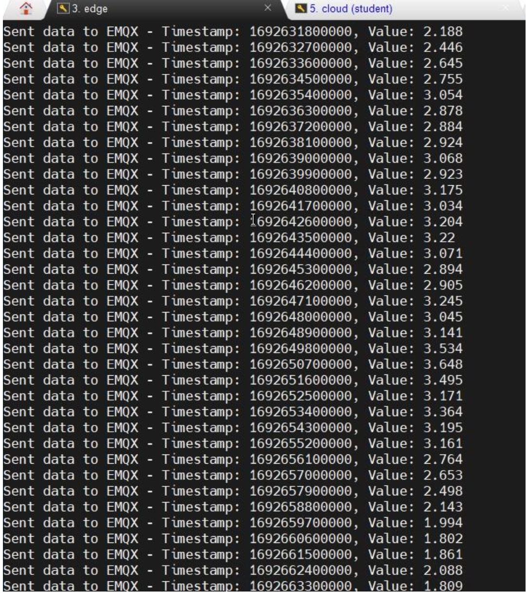
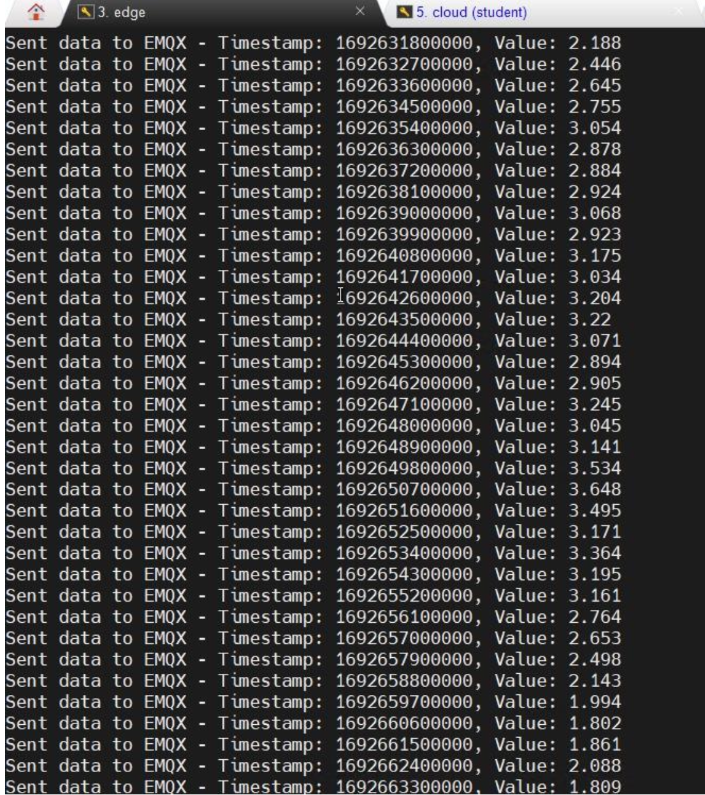
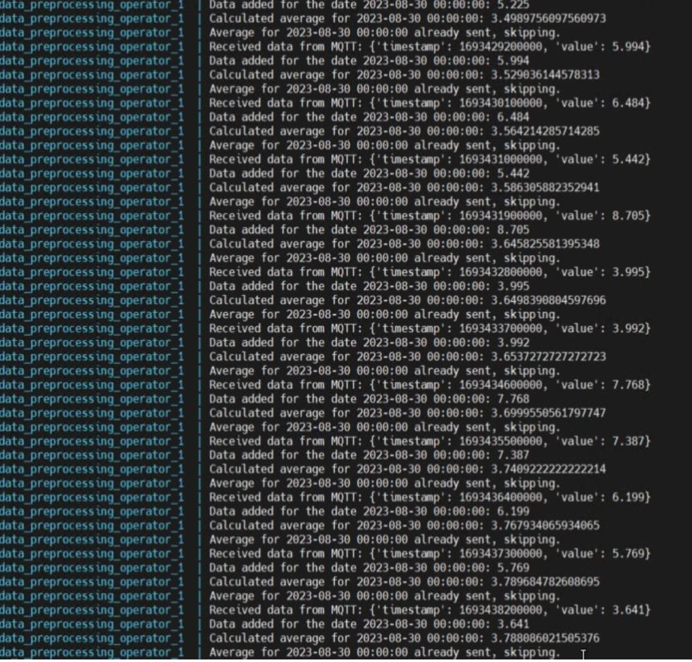
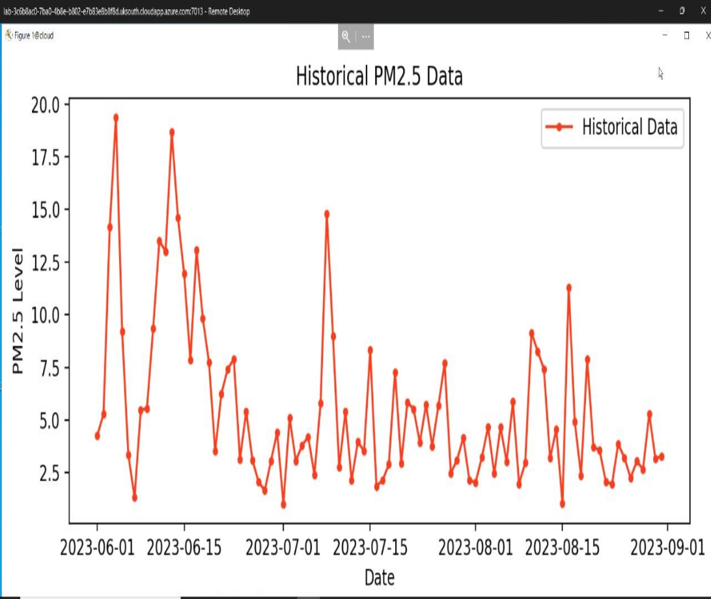
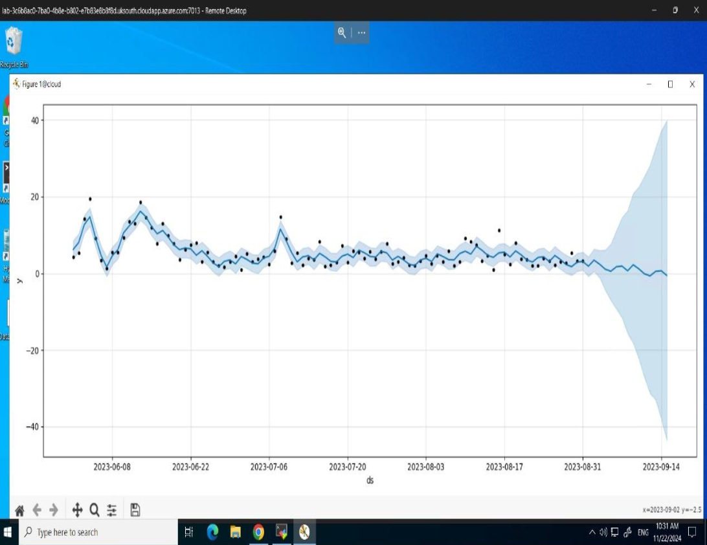

# 🌫️ IoT Air Quality Prediction Pipeline

This project demonstrates the design and deployment of a full IoT data processing pipeline across **Azure-based Edge and Cloud VMs** using **Docker, MQTT (EMQX), RabbitMQ**, and a time-series **machine learning predictor** for PM2.5 air quality data.

---

## 📌 Features

- ✅ Docker-based MQTT Broker (EMQX)
- ✅ IoT data ingestion from Newcastle Urban Observatory
- ✅ Python-based data preprocessing operator
- ✅ RabbitMQ-based message passing to ML engine
- ✅ Daily averaging & outlier filtering
- ✅ PM2.5 trend forecasting for 15 days using Prophet
- ✅ Matplotlib-based visualizations

---

## 🛠️ Tech Stack

| Component        | Tech Used                            |
|------------------|--------------------------------------|
| Data Source       | Newcastle Urban Observatory API      |
| Data Broker (Edge)| EMQX (Docker)                        |
| Preprocessing     | Python (Paho-MQTT, Pika)             |
| Messaging (Cloud) | RabbitMQ + Docker Compose            |
| ML Engine         | Prophet + Pandas + Matplotlib        |
| Deployment        | Azure Lab (Edge + Cloud Ubuntu VMs)  |

---

## 📂 Project Structure

- `docs/`: Screenshots of setup, logs, and results
- `CSC8112-report-samuel-pillai.pdf`: Final coursework report
- `README.md`: This file

---

## 📸 Screenshots

### 🔹 Data Injector Output

### 🔹 Data Injector Confirmation

### 🔹 Preprocessing Output

### 🔹 RabbitMQ Consumer Waiting

### 🔹 PM2.5 Daily Average Plot

### 🔹 PM2.5 Prediction Plot

---

## 📄 License

This project is published under the MIT License.

---

## 👨‍💻 Author

**Samuel Sathiyamoorthy**  
MSc Cloud Computing – Newcastle University  
📫 ssamuelpillai@gmail.com
